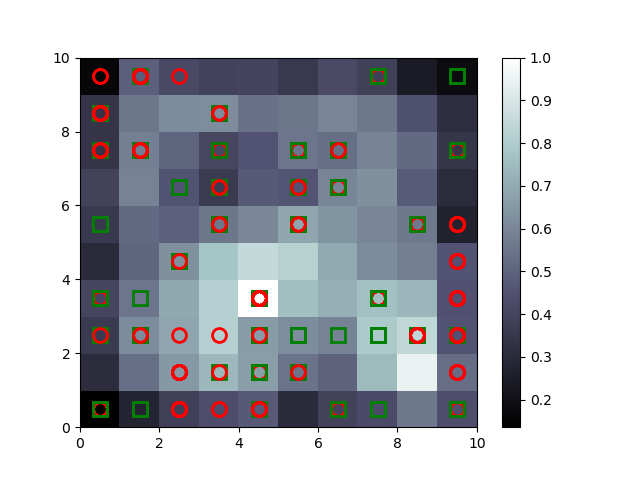

# Credit_Fraud_Detection-using-SOMs

## Overview
**Self Organising Maps (SOMs)** are very efficient way of analyzing huge dataset as it reduces the dimentionality of the dataset to 1 or 2 dimentions (at max) in order to make visualisation easier. These belong to Unsupervised Models. Since SOMs are not available in any library, **minisom.py** - a prebuilt code containing readily usable _CLASS: Minisom_ is used to implement the SOM.

**Credit_Fraud_Detection.py** - Deals with imlementing the SOM to build **Frequency Map** in order to identify the outliers.

**Credit_Fraud_Prediction.py** - Deals with implementing teh Detection Technique using SOMS (Same as above) and **using ANN to build a classifier that predicts the probability of fraudulent activity by the customers**.

## Dataset 
The Dataset taken from **UCI machine learning repository called _"Statlog (Australian Credit Approval) Dataset"_.** It contains various credentials of 690 customers of a Bank. Last column contains whether the application given by that particular customers was approved (1) or not (0). We need to detect the fraudlent activity.

_NOTE: The credentials ofthe customers have been encoded._

## Fraud Detection
* 2D Neuron Lattice = 10 X 10 
* No. of. Features (input_len) = 15
* Learning Rate = 0.5

* Higher the **MID - Mean Inter-neuron Distance** , farther it is from the **BMU - Best Matching Unit** of a sub-group.
* Lower MID - Highest MID :: Black (0) - White (1). So _White boxes are outliers._
* **Red Circle** are the datapoints representing the customers that got approval provided that they has cheated
* **Green Squares** are the datapoints representing the customers that didn't got approval.

* Customers that Commited Fruad are represented by **White Squares containing Red Circle**. It may or may not contain Green Square. 

* _Result: Obtained a matrix **[690 x 1]** containing **1s** against the customers identified as frauds while **0s** against the rest._

## Fraud Prediction
Using Artificial Neural Network to predict how likely is the customer to indulge forgery. 
_Features : All the columns of the dataset _
_Labels: Result obtained from the _Fraud_Detection.py_  ._

**HyperParameters**
* epochs = 10
* batch_size = 23 
